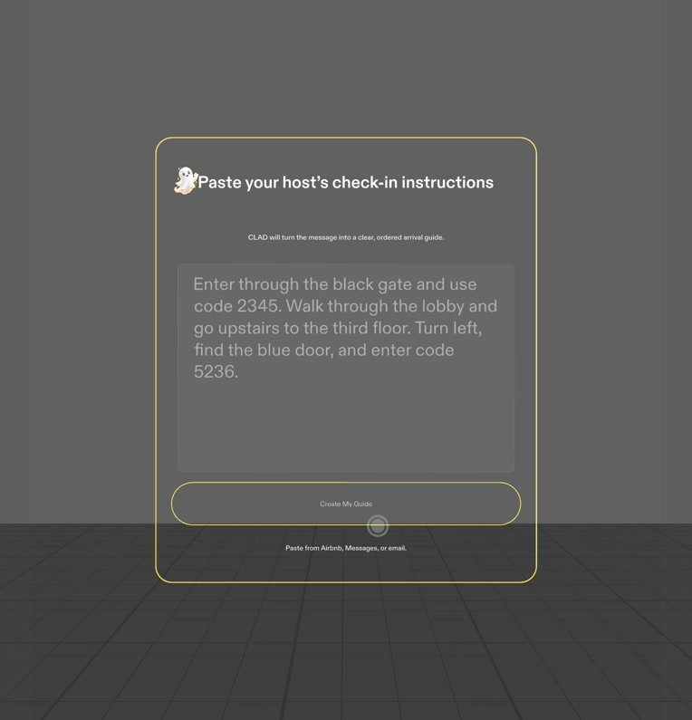
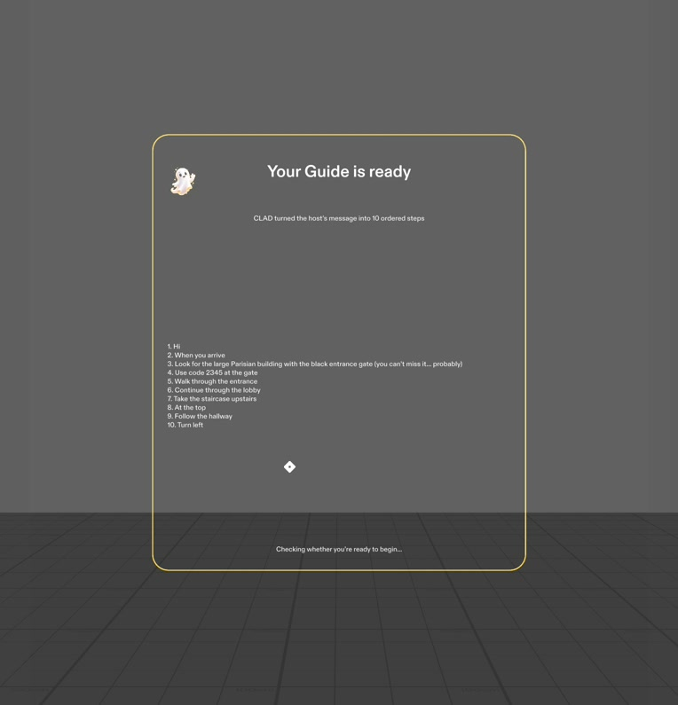
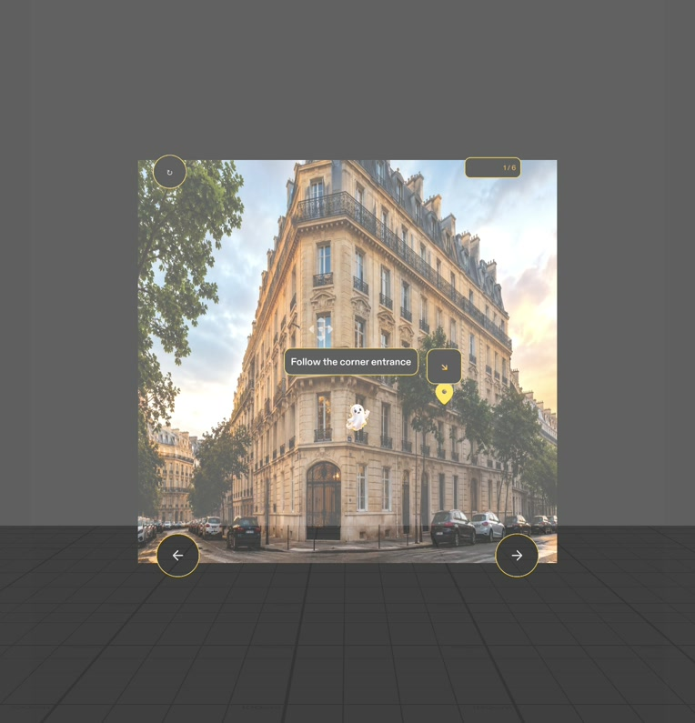
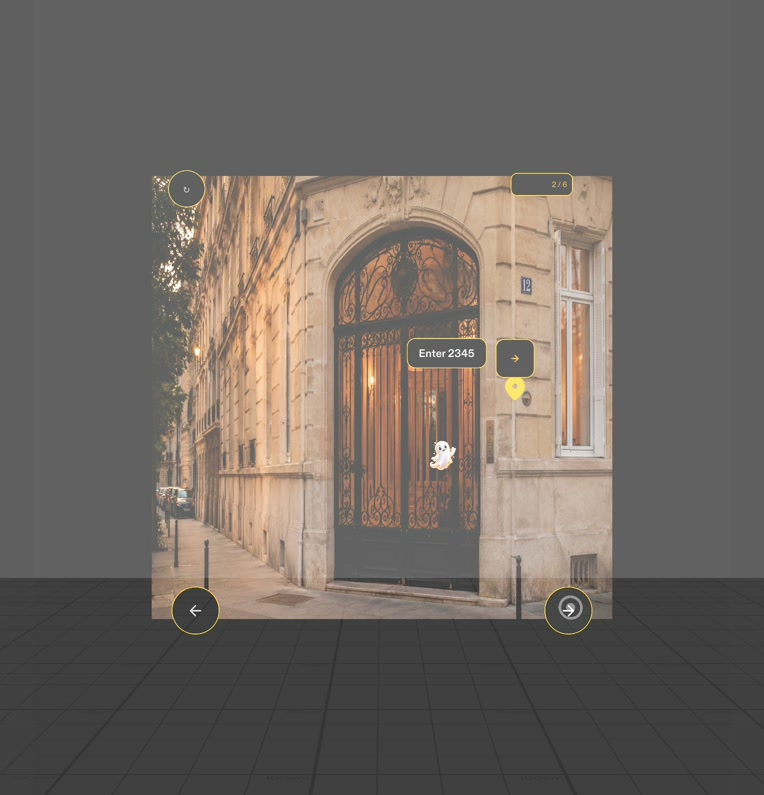
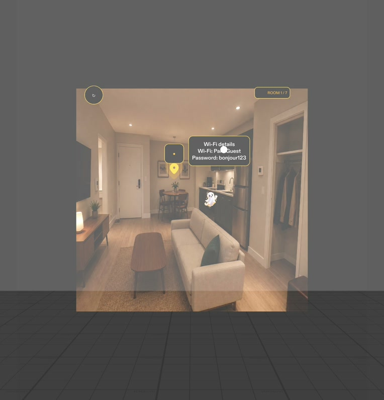
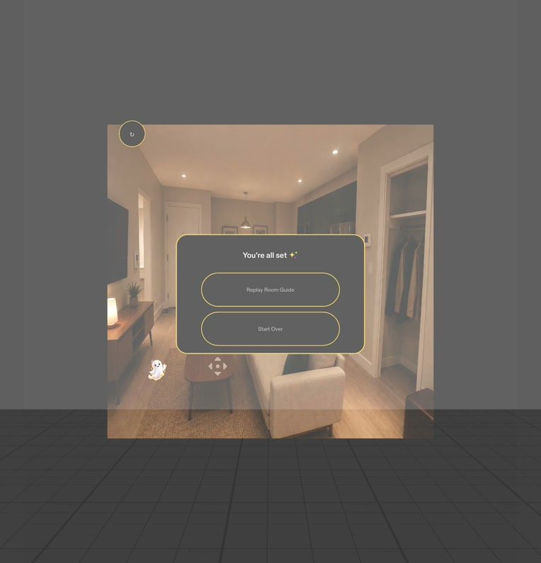

# Guide

Guide turns a host’s written check-in message into a step-by-step spatial arrival experience for Snap Specs. A friendly ghost companion leads the guest from the street to the correct door, places codes beside the relevant keypad, and continues inside with an interactive Room Guide.

Built with Lens Studio 5.23.1 for Specs.

## Demo

[](https://youtube.com/shorts/_asF8Wq2Tps)

*Click the image to watch the full demo on YouTube.*

## The experience

1. Paste the host’s check-in instructions.
2. Select **Create My Guide** to turn the message into ordered steps.
3. Confirm that you have arrived at the property.
4. Follow spatial markers, compact instructions, access codes, and the ghost guide through the building.
5. Enter the final blue door and continue directly into the room.
6. Tap through seven spatial Room Guide markers: Wi-Fi, lights, spare blanket, thermostat, towels, kitchen essentials, and checkout.
7. Replay only the Room Guide or start the whole experience over.

## Real app screenshots

These images were captured from the running Guide project in Lens Studio Specs Preview.

<table>
  <tr>
    <td align="center"><br><sub>Paste host instructions</sub></td>
    <td align="center"><br><sub>Generated steps</sub></td>
    <td align="center"><br><sub>Begin spatial guidance</sub></td>
  </tr>
  <tr>
    <td align="center"><br><sub>Code at the correct gate</sub></td>
    <td align="center"><br><sub>One room marker at a time</sub></td>
    <td align="center"><br><sub>Replay or start over</sub></td>
  </tr>
</table>

## Highlights

- Converts free-form host instructions into an ordered arrival checklist.
- Uses a consistent black, gold, and white visual system designed for high contrast in Specs Preview.
- Keeps navigation spatial with compact labels, directional markers, access codes, and a moving ghost companion.
- Presents the room cleanly before revealing one interactive guide item at a time.
- Supports a full reset from any guide screen and a room-only replay after completion.

## Project structure

```text
Assets/
├── Guide/Images/          # Building and room imagery
├── Icons/                 # Guide ghost and navigation icons
├── Scripts/
│   ├── GuideMain.ts       # Flow, parsing, route, room, replay, and reset state
│   └── GuideUI.ts         # Specs UI, spatial markers, interactions, and animations
└── Scene.scene            # Main Lens Studio scene

building/                  # Original Paris building reference images
Specs Base Template.esproj # Lens Studio project
```

## Run locally

1. Install [Git LFS](https://git-lfs.com/) before cloning.
2. Clone the repository and download its LFS assets:

   ```bash
   git clone https://github.com/jayasrisng/clad-guide.git
   cd clad-guide
   git lfs pull
   ```

3. Open `Specs Base Template.esproj` in Lens Studio 5.23.1 or newer.
4. Run the project with **SPECS 27 Preview**.
5. Paste check-in instructions, create the guide, and exercise the flow from arrival through Room Guide completion.

## Current scope

Guide is a working Lens Studio prototype. The included Paris route and room are the demonstration property; instruction parsing runs locally in the Lens and the project does not require a hosted backend.
